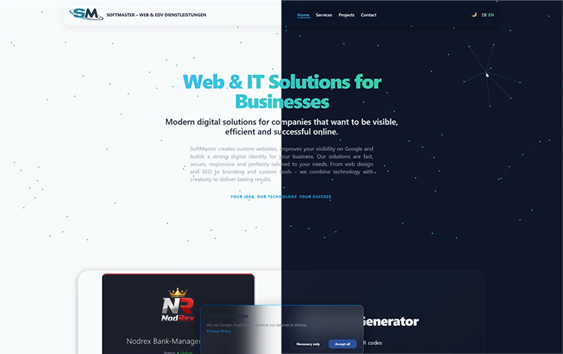
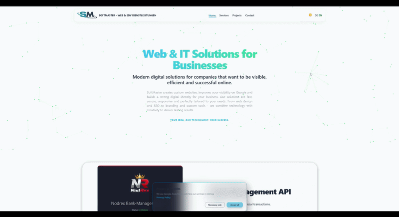

# Softmaster.at Node.js Version

[](https://github.com/Nodrex-86/softmaster.at-nodejs)

[](https://node.softmaster.at)

This is the Node.js/Express implementation of [softmaster.at](https://softmaster.at). 
The project features a dynamic EJS-based templating system with multi-language support.


## 🌐 Live Demo
- **Primary:** [https://node.softmaster.at/](https://node.softmaster.at/)
- **Fallback:** [https://softmaster-at-nodejs.onrender.com/](https://softmaster-at-nodejs.onrender.com/)

## Screenshots

### Theme Support

The website supports automatic **day/night mode** depending on the system time,
with a manual toggle available in the navigation.



### Theme Switch




## 🌟 Features
- **Engine:** Express.js & EJS
- **SEO:** Dynamic meta tags and canonical URLs generated via middleware.
- **Languages:** German (default) and English via JSON localization files.
- **Performance:** Optimized LCP and reduced layout thrashing (Canvas/Slider).
- **Contact:** Secure nodemailer integration using environment variables.

## Latest Updates
- ✅ **SSL & Custom Domain:** Fully configured with Let's Encrypt via Render.
- ✅ **Error Handling:** Added custom 404 page for better UX and build stability.
- ✅ **Email Integration:** Optimized SMTP transport for production environments.
- ✅ **Security:** Cloudflare Turnstile integrated for spam protection.

## Tech Stack

Backend  
- Node.js 24  
- Express.js  

Frontend  
- EJS templating  
- Tailwind CSS  
- Vanilla JavaScript  

Infrastructure  
- Render Cloud Hosting  
- GitHub CI Deployment  

Security  
- Cloudflare Turnstile  
- Environment Variables


## Architecture

The application is built with Express and uses EJS as a templating engine.
Project data is loaded dynamically from a JavaScript data module and rendered on the server.

The site is deployed on Render with automatic deployment from GitHub.
```text
softmaster.at (PHP version)
        │
        │
node.softmaster.at (Node.js version)
        │
        │
GitHub Repository
        │
        │
Render Cloud Deployment
```

## 📂 Project Structure

```text
softmaster.at-nodejs
│
├── .env.example
├── data.js
├── package.json
├── render.yaml
├── server.js
│
├── views
│   ├── 404.ejs
│   ├── contact.ejs
│   ├── imprint.ejs
│   ├── index.ejs
│   ├── privacy.ejs
│   ├── projects.ejs
│   └── services.ejs
│
├── public
│   ├── css
│   ├── js
│   ├── icons
│   └── images
│
├── docs
│   ├── theme-preview.png
│   └── theme-switch.gif

```

## Setup
1. `npm install`
2. Create a `.env` file (see `.env.example`)
3. `npm start`
